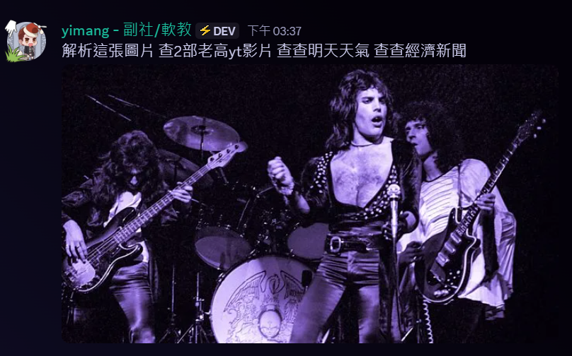
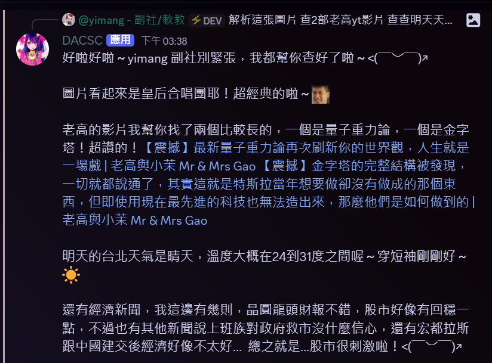

# Discord-Gemini-Bot
使用Gemini API的大安電研Discord AI聊天機器人

## 如何使用
```pip install -U -r requirements.txt```

在 `.env.example` 放入以下參數:
- Gemini API Key
- Discord bot token
- Wolframalpha app ID
- Google Custom Search API Key
- Google Custom Search API Search Engine ID
- YouTube Data API v3 API Key

然後將 `.env.example` 更名成 `.env`

在使用頻道輸入 !whitelist 頻道id
或是直接編輯 `whitelist.json`，格式如下
```json
[id1, id2]
```

運行 `bot.py`

## 功能
- AI聊天
- 短期記憶
- 定期將聊天紀錄統整放入長期記憶
- 辨識圖片
- 爬取網址title來判斷內容
- 透過 Wolframalpha 和 Google 搜尋內容
- 爬取 nownews 各版新聞
- 搜尋 Youtube 影片

## Branches
- main - 主分支
- English-version - 英文版本(by [nlcat](https://github.com/956zs))

## Demo



## FAQ
- [如何獲得 Gemini API Key](https://github.com/imyimang/discord-gemini-chat-bot/blob/main/docs/zh/q2.md)

更多問題請見 [此專案](https://github.com/imyimang/discord-gemini-chat-bot)